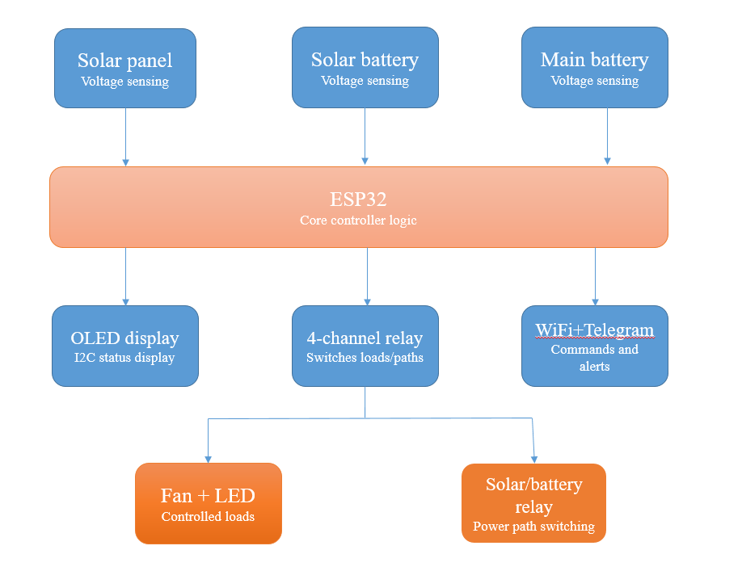

<div align="center">

# 🌞 Solar IoT System

**An ESP32-based Solar Power Monitoring & Load Control System**
Automatic solar/battery switching · Remote Telegram control · Live OLED status


-00599C)


</div>

---

## 🎬 Demo Video

[](https://drive.google.com/drive/u/5/folders/1yFpwa9LqbSHIEKqMaSj3UTiGpZmaOin4)

---

## 📖 Table of Contents

- [Project Overview](#-project-overview)
- [Features](#-features)
- [System Architecture](#-system-architecture)
- [Hardware Components](#-hardware-components)
- [Pin Configuration](#-pin-configuration)
- [Software / Libraries Used](#-software--libraries-used)
- [How It Works](#-how-it-works)
- [Telegram Bot Commands](#-telegram-bot-commands)
- [Setup Instructions](#-setup-instructions)
- [Project Images](#-project-images)
- [Testing & Calibration Notes](#-testing--calibration-notes)
- [Future Improvements](#-future-improvements)
- [Authors](#-authors)

---

## 🔍 Project Overview

This project is a **smart solar power management system** built around the ESP32 microcontroller. It continuously monitors voltage from a **solar panel**, a **solar battery**, and a **main (backup) battery**, and automatically decides the best power source to use at any given moment.

Based on battery health, it automatically controls a **fan** (for cooling/ventilation) and an **LED** (for lighting/indication), switching them off during critically low battery conditions to prevent damage. All of this can also be **overridden manually and remotely through a Telegram bot**, and the current status is always visible on a local **OLED display**.

---

## ✨ Features

| | |
|---|---|
| 🔋 **Automatic power switching** | Solar → Solar Battery → Main Battery, based on real-time voltage |
| 🌀 **Automatic Fan control** | Turns on/off based on battery voltage thresholds |
| 💡 **Automatic LED control** | Stays on normally, shuts off at critical battery levels |
| 📲 **Remote Telegram control** | Override Fan and LED independently, from anywhere |
| 🔄 **Auto/Manual toggle** | Instantly revert to full automatic control |
| 📟 **Live OLED display** | Voltages, power mode, and Fan/LED status (`[A]`/`[M]`) |
| 🛡️ **Battery protection** | Cuts non-essential loads at critical voltage |
| 📡 **WiFi connectivity** | Remote notifications and command handling |
| 📉 **Smoothed ADC readings** | Exponential smoothing filters out sensor noise |

---

## 🏗 System Architecture

<div align="center">

</div>

Voltage readings from the **solar panel**, **solar battery**, and **main battery** feed into the **ESP32**, which runs the core control logic. The ESP32 drives the **OLED display** for live status, the **4-channel relay module** for switching loads and power paths, and connects over **WiFi/Telegram** for remote commands and alerts. The relay module in turn switches the **Fan + LED** loads and the **solar/battery power path**.

> 

---

## 🧰 Hardware Components

| Component | Purpose | Quantity |
|---|---|---|
| ESP32 Dev Board | Main microcontroller — WiFi, ADC, control logic | 1 |
| SH1106 OLED Display (128x64, I2C) | Real-time status display | 1 |
| 4-Channel Relay Module | Switching Fan, LED, Solar path, Battery path | 1 |
| Mini Solar Panel | Power generation source | 1 |
| 18650 Li-ion Battery (3.7V, 3000mAh) | Solar battery — stores solar energy | 1 |
| Cylindrical Battery (3.7V) | Main/backup battery | 1 |
| TP4056 USB Charging/Protection Module | Charges and protects the Li-ion battery | 1 |
| Buck Converter Module | Steps down voltage for regulated supply | 1 |
| Cooling Fan (5V DC) | Controlled load (ventilation) | 1 |
| LED Module | Controlled load (lighting/indicator) | 1 |
| Voltage Sensor / Divider Module | Step down voltages for ESP32 ADC pins | As needed |
| Breadboard, Jumper Wires | Prototyping and connections | As needed |


---

## 🔌 Pin Configuration

| Function | ESP32 Pin |
|---|---|
| Solar Battery Voltage Sense | GPIO 34 |
| Solar Panel Voltage Sense | GPIO 32 |
| Main Battery Voltage Sense | GPIO 35 |
| Relay – Fan (CH1) | GPIO 26 |
| Relay – LED (CH2) | GPIO 27 |
| Relay – Solar Path (CH3) | GPIO 14 |
| Relay – Battery Path (CH4) | GPIO 13 |
| OLED Display | I2C (SDA/SCL default pins) |

---

## 💻 Software / Libraries Used

- **Arduino IDE** (ESP32 board package)
- `Wire.h` — I2C communication
- `Adafruit_GFX.h` & `Adafruit_SH110X.h` — OLED display driver
- `WiFi.h` — ESP32 WiFi connectivity
- `HTTPClient.h` — HTTP requests to Telegram Bot API
- **Telegram Bot API** — remote command & notification interface

---

## ⚙️ How It Works

1. **Voltage Sensing** — ESP32 reads analog voltage from the solar panel, solar battery, and main battery via calibrated voltage dividers, with exponential smoothing to reduce noise.
2. **Power Mode Selection**:
   - If panel voltage > threshold → use **SOLAR** directly, charge/bypass battery
   - If no sun, but solar battery is healthy → use **SOLAR BATT**
   - If solar battery drops too low → switch to **MAIN BATT**
3. **Load Protection**:
   - Full sun or healthy battery → Fan ON, LED ON
   - Battery critical → Fan OFF, LED OFF (protects battery from damage)
   - Battery in "low" range → Fan cycles based on hysteresis thresholds; LED stays on unless critical
4. **Manual Override (Telegram)** — Fan and LED each have independent manual flags, so overriding one never affects the other. Sending `/auto` restores full automatic control.
5. **Status Reporting** — OLED updates every second; Telegram sends a notification whenever the power mode changes, and confirms every manual command.

---

## 📲 Telegram Bot Commands

| Command | Action |
|---|---|
| `/fanon` | Turn Fan ON manually |
| `/fanoff` | Turn Fan OFF manually |
| `/ledon` | Turn LED ON manually |
| `/ledoff` | Turn LED OFF manually |
| `/auto` | Return both Fan and LED to automatic control |

---

## 🛠 Setup Instructions

1. **Hardware Assembly**
   - Wire the solar panel, solar battery, and main battery to their respective voltage divider circuits and ESP32 ADC pins.
   - Connect the 4-channel relay module to control Fan, LED, Solar path, and Battery path.
   - **Important:** Ensure load wiring uses the relay's **NO (Normally Open)** terminal, not NC — otherwise ON/OFF behavior will be inverted.
   - Connect the SH1106 OLED display via I2C (SDA/SCL).

2. **Software Setup**
   - Install **Arduino IDE** and add the **ESP32 board package**.
   - Install required libraries: `Adafruit GFX`, `Adafruit SH110X`.
   - Open the project `.ino` file from [`final_project_code`](./final_project_code).

3. **Configure Credentials**
   - Replace the placeholders in the code with our own:
     ```cpp
     const char* ssid = "WIFI_SSID";
     const char* password = "WIFI_PASSWORD";
     const char* botToken = "TELEGRAM_BOT_TOKEN";
     const char* chatID = "TELEGRAM_CHAT_ID";
     ```
   

4. **Calibrate Voltage Readings**
   - Measure actual voltage with a multimeter and compare with raw ADC readings to compute our own calibration constants (e.g., `SOLAR_BATT_CAL`).

5. **Upload & Run**
   - Select the correct ESP32 board and COM port in Arduino IDE.
   - Upload the sketch.
   - Open Serial Monitor (115200 baud) to verify readings and WiFi connection.
   - Send `/fanon`, `/ledoff`, etc. to your Telegram bot to test manual control.

---

## 🖼 Project Images


---

## 🧪 Testing & Calibration Notes

During development and testing, the following real issues were identified and resolved:

- **Loose sensor connections** caused inconsistent/fluctuating voltage readings — resolved by re-securing screw terminals.
- **OLED driver mismatch** — the display was initially assumed to be SSD1306 but was actually an **SH1106**, requiring the correct Adafruit library (`Adafruit_SH110X`) for proper rendering.
- **Relay polarity/wiring mistake** — the Fan's positive wire was connected to the relay's **NC (Normally Closed)** terminal instead of **NO (Normally Open)**, causing inverted ON/OFF behavior even though the software logic was correct.
- **Manual override conflict** — a single shared `manualMode` flag caused Fan and LED overrides to affect each other. This was fixed by introducing **independent `fanManual` and `ledManual` flags**, allowing each load to be controlled separately.
- **Voltage calibration drift** — small differences between multimeter readings and OLED-displayed voltage were traced to the ESP32 ADC's known non-linearity around the single calibration point used; recalibration improved accuracy.

---

## 🚀 Future Improvements

- Add data logging (e.g., to Google Sheets or a local SD card) for long-term voltage/performance analysis
- Add a mobile dashboard or web interface alongside Telegram control
- Implement MPPT (Maximum Power Point Tracking) for improved solar charging efficiency
- Add more sensors (temperature, current) for fuller system health monitoring

---

## 👥 Authors

- **Tanha Islam Sinthi** — Roll: 2207023
- **Sanzida Alam** — Roll: 2207010

GitHub: [@sinthi23](https://github.com/sinthi23)

---

<div align="center">

*Developed as part of an academic IoT/embedded systems course project.*

</div>
